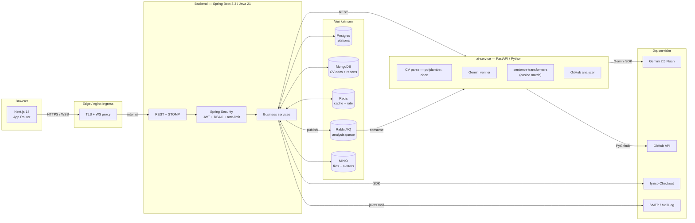
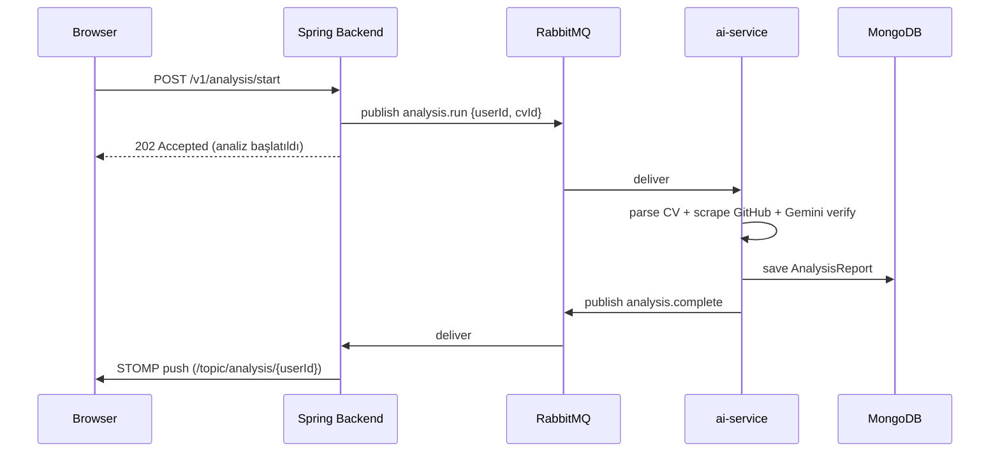

# Synapse — AI Destekli CV Doğrulama ve Yetkinlik Analiz Platformu

> **SDÜ Bilgisayar Mühendisliği — Bitirme Projesi**
> Furkan Patat · Öğrenci No 2121032010 · 2025-2026

CV'leri yükleyip GitHub aktivitesiyle çapraz doğrulayan, yapay zekâ
destekli yetkinlik analizi üreten ve LinkedIn tarzı bir iş bulma
platformu. Adaylar CV'lerinin gerçekten neyi yansıttığını öğrenir;
şirketler ise objektif sinyaller üzerinden işe alır.

---

## İçindekiler

1. [Yetenekler](#yetenekler)
2. [Mimari](#mimari)
3. [Teknoloji yığını](#teknoloji-y%C4%B1%C4%9F%C4%B1n%C4%B1)
4. [Hızlı başlangıç](#h%C4%B1zl%C4%B1-ba%C5%9Flang%C4%B1%C3%A7)
5. [Demo akışı](#demo-ak%C4%B1%C5%9F%C4%B1)
6. [Yapay zekâ kullanım alanları](#yapay-zek%C3%A2-kullan%C4%B1m-alanlar%C4%B1)
7. [Veri modeli](#veri-modeli)
8. [Güvenlik](#g%C3%BCvenlik)
9. [Gözlemlenebilirlik](#g%C3%B6zlemlenebilirlik)
10. [Test + CI](#test--ci)
11. [Production deploy](#production-deploy)
12. [Dizin yapısı](#dizin-yap%C4%B1s%C4%B1)

---

## Yetenekler

### Aday (USER)
- 📄 **CV yönetimi** — PDF/DOCX yükle (parse), veya **AI yardımcılı sıfırdan oluştur** (CV Builder); PDF olarak yazdır
- 🧠 **AI yetkinlik analizi** — CV skill'leri × GitHub aktivitesi → 0-100 güven puanı + bölüm bölüm yorum
- 🕸️ **Skill graph** — sentence-transformers ile beceri kümeleri, force-directed görselleştirme
- 🐙 **GitHub canlı analizi** — kullanıcı adı yapıştır, repo dilleri + manifest taraması + zaman çizelgesi
- 🔒 **Private repo desteği** — OAuth ile bağla, kendi private repoların da analize dahil olur
- 🎤 **AI sesli mülakat koçu (Mira)** — TTS + STT, 14 sektör + role özel sorular, STAR puanlaması
- 🎯 **İlana özel hazırlık** — başvurduğun ilan için şirket-kültür + teknik sorular
- 🎥 **WebRTC video mülakat** — tarayıcı-içi peer-to-peer + canlı transkript + AI değerlendirme
- 💼 **İş ilanları** — embedding similarity tabanlı öneriler, filtreler, kaydet
- 💬 **Real-time mesajlaşma** + 🔔 bildirimler (WebSocket/STOMP)
- ⭐ **Premium** — Iyzico ile ödeme, PDF rapor indirme, sınırsız analiz

### Şirket (COMPANY)
- İlan CRUD + AI ile ilan metni üret
- Başvuran havuzu + AI eşleşme skoru + AI işe-alım brief'i
- **AI-üretilmiş CV tespiti** (heuristik + Gemini hakem — HUMAN/SUSPICIOUS/AI_LIKELY)
- Aday detayında mülakat planla, sonrası AI verdict (HIRE/MAYBE/PASS)
- Analytics dashboard (funnel, time-to-hire, top jobs)

### Admin (ADMIN)
- Kullanıcı / şirket yönetimi (ban, plan değiştir, şirket onayla)
- Audit log (her kritik aksiyon)
- Sistem analytics (kullanıcı büyümesi, plan dağılımı, top skills)

---

## Mimari



### Asenkron CV analiz akışı



---

## Teknoloji yığını

| Katman | Teknoloji |
|---|---|
| **Frontend** | Next.js 14 (App Router) · TypeScript · TailwindCSS · Geist · lucide-react · Recharts · zustand · axios |
| **Backend** | Spring Boot 3.3 · Java 21 · Spring Security · Spring Data JPA · Spring Data MongoDB · Spring AMQP · Spring WebSocket (STOMP) |
| **AI servis** | Python 3.11 · FastAPI · Uvicorn · google-generativeai (Gemini 2.5 Flash) · sentence-transformers · pdfplumber · python-docx · PyGithub · loguru |
| **Veri** | PostgreSQL 16 (relational) · MongoDB 7 (CV docs + reports) · Redis 7 (cache + token bucket) · RabbitMQ 3.13 (async queue) · MinIO (S3-uyumlu) |
| **Auth** | JWT (access + refresh, rotation) · bcrypt · TOTP 2FA · Google + GitHub OAuth |
| **Ödeme** | Iyzico Checkout (sandbox + stub mode) |
| **Observability** | Spring Actuator + Micrometer · Prometheus · Grafana |
| **Test** | JUnit 5 + Mockito + AssertJ · Testcontainers · GitHub Actions CI |
| **Container** | Docker Compose (dev) · Kubernetes (prod) |

---

## Hızlı başlangıç

### Önkoşullar
- Docker Desktop
- Java 21 + Maven (backend için — `./mvnw` wrapper var)
- Node 20+ (frontend için)
- Python 3.11 + conda (ai-service için)

### 1. Veri stack'ini ayağa kaldır

```bash
cd infra
docker compose up -d
```

Servisler:
| Servis | Port | UI |
|---|---|---|
| Postgres | 5433 | — |
| MongoDB | 27017 | — |
| RabbitMQ | 5672 | http://localhost:15672 (cvp/cvp_dev_pass) |
| Redis | 6379 | — |
| MinIO | 9000 | http://localhost:9001 (cvp/cvp_dev_pass) |
| MailHog | 1025 (SMTP) | http://localhost:8025 |
| Prometheus | 9090 | http://localhost:9090 |
| Grafana | 3001 | http://localhost:3001 (cvp/cvp_dev_pass) |

### 2. Backend (Spring Boot)

```bash
cd backend
export GEMINI_API_KEY="..."         # zorunlu (AI çağrıları için)
export GITHUB_TOKEN="..."           # opsiyonel (60 → 5000 req/h)
./mvnw spring-boot:run
```

http://localhost:8080 · Swagger UI: http://localhost:8080/swagger-ui.html

Flyway migration'ları otomatik çalışır (V1-V15).

### 3. ai-service (FastAPI)

```bash
conda create -n cvp-ai python=3.11 -y
conda activate cvp-ai
cd ai-service
pip install -r requirements.txt
export GEMINI_API_KEY="..."
uvicorn app.main:app --reload --port 8000
```

İlk çağrıda sentence-transformers modeli iner (~80 MB, ~30 s).

### 4. Frontend (Next.js)

```bash
cd frontend
npm install
npm run dev
```

http://localhost:3000

### 5. Demo veri ekle (opsiyonel)

```bash
docker exec -i cvp-postgres psql -U cvp -d cvplatform < infra/seed_demo.sql
```

5 kullanıcı + 2 şirket + 6 ilan + 5 başvuru + mesajlar + bildirimler.
Login: `ayse.demo@cv.local` / `Demo123!` (USER), `hr@technova.demo` / `Demo123!` (COMPANY).

---

## Demo akışı

**Uçtan uca 5 dakikalık demo senaryosu:**

1. **`ayse.demo@cv.local` ile giriş** → Dashboard'da AI doğrulanmış skor
2. **CV Builder** (`/dashboard/cv/builder`) — bir bölüme "AI cilala" bas, vurucu hale gelsin → PDF olarak indir
3. **GitHub Analizi** (`/dashboard/github-analyze`) — `furkanpatat` yapıştır → repo timeline + skill kümeleri
4. **Skill Grafı** (`/dashboard/skills`) — semantic clustering, force-directed
5. **Mülakat Pratiği** (`/dashboard/mock-interview`) — Sağlık sektörü + "Hemşire" rolü seç → Mira sesli soru sorar → cevap ver → AI raporu
6. **`hr@technova.demo` ile gir** (incognito) → Başvuranlardan birini aç → "AI-yazımı tespiti" butonuna bas
7. **"Video mülakat planla"** → iki sekmede aynı odaya gir → konuşun → "Bitir" → şirket panelinde AI HIRE/MAYBE/PASS rozeti
8. **`/dashboard/billing`** → "PREMIUM" → Iyzico checkout (stub veya gerçek)

---

## Yapay zekâ kullanım alanları

Toplam **14 ayrı AI use-case**, hepsi Gemini 2.5 Flash üzerinde.

| # | Kullanım | Endpoint | Output |
|---|---|---|---|
| 1 | CV parse | `POST /v1/cv/upload` | yapılandırılmış JSON (Personal/Skills/Experience/...) |
| 2 | Skill verification (GitHub × CV) | `POST /v1/analysis/start` | per-skill 0-100 + evidence + inconsistencies |
| 3 | AI biyografi üret | `POST /v1/ai/bio` | profil özeti |
| 4 | AI cover letter | `POST /v1/ai/cover-letter/{jobId}` | başvuru ön yazısı |
| 5 | AI match explanation | `GET /v1/ai/match-explanation/{jobId}` | "neden uygunsun" yorumu |
| 6 | AI skill gap | `GET /v1/ai/skill-gap/{jobId}` | öğrenme yol haritası |
| 7 | AI hiring brief | `GET /v1/ai/hiring-brief/{applicationId}` | İK için aday özeti |
| 8 | AI mülakat soruları | `GET /v1/ai/interview-questions/{applicationId}` | role özel sorular |
| 9 | AI CV iyileştirme | `GET /v1/ai/cv-suggestions` | madde madde öneriler |
| 10 | AI iş ilanı metni | `POST /v1/ai/job-description` | şirket için ilan draft'ı |
| 11 | AI CV rewrite (builder) | `POST /v1/ai/cv-rewrite` | section-aware cilala |
| 12 | Synapse Chat (role-aware) | `POST /v1/ai/chat` | sohbet asistanı |
| 13 | AI-üretilmiş CV tespiti | `POST /v1/ai-detection/applications/{id}` | HUMAN/SUSPICIOUS/AI_LIKELY |
| 14 | Mülakat AI değerlendirme | `POST /v1/interviews/{token}/evaluate` | HIRE/MAYBE/PASS + güçlü/zayıf |

**Embedding tabanlı (sentence-transformers):**
- İş ↔ aday cosine match (`/v1/jobs/recommended`)
- Skill semantic clustering (`/v1/skills/graph`)

**Speech (Web Speech API):**
- TTS — Mira'nın sorularını Türkçe sesle söyler
- STT — adayın cevaplarını canlı transkript

---

## Veri modeli

**PostgreSQL** (Flyway V1-V15):

```
users ─┬─ refresh_tokens
       ├─ email_verification_tokens
       ├─ password_reset_tokens
       ├─ saved_jobs ─── job_postings ─── applications
       ├─ companies ─── job_postings
       ├─ conversations ─── messages
       ├─ notifications
       ├─ audit_logs
       ├─ interview_sessions
       └─ mock_interview_sessions
```

**MongoDB**:
- `cv_documents` — parse edilmiş veya builder ile oluşturulmuş CV'ler
- `analysis_reports` — AI yetkinlik raporları

15 migration. `oauth_provider`, `totp_secret`, `cv_ai_verdict`, `ai_recommendation`, `github_connect_token` gibi feature-spesifik kolonlar versiyon kontrollü.

---

## Güvenlik

| Katman | Uygulama |
|---|---|
| Kimlik | JWT access (15dk) + refresh (7g, rotate-on-use, sha256 hash) |
| Şifre | bcrypt (cost 12) |
| 2FA | TOTP (RFC 6238, ±1 step skew) — Google Authenticator/Authy uyumlu |
| OAuth | Google + GitHub (authorization code, state cookie) |
| RBAC | `@PreAuthorize` annotation (USER / COMPANY / ADMIN) |
| CORS | yalnız `frontend.base-url` whitelisted |
| Rate limit | Redis token bucket (FREE 10/saat AI, PREMIUM 100/saat) |
| Audit | Her kritik aksiyon `audit_logs` tablosuna (login, başvuru durumu, plan değişimi, ban, vb.) |
| AI-CV detection | Hile / sahtekarlık önlemi |
| Secret yönetimi | env-driven config, prod için K8s SealedSecrets önerisi |

---

## Gözlemlenebilirlik

`infra/prometheus/` ve `infra/grafana/provisioning/` ile gelir. `docker compose up` sonrası **Grafana**'da hazır dashboard:

- HTTP req/sec (URI bazında)
- p95 latency (histogram_quantile, SLO bucket'ları: 50/100/300/1000 ms)
- JVM heap MB
- Live thread count
- 5xx error %

Access: http://localhost:3001 (cvp/cvp_dev_pass) → "Synapse — Backend Overview"

Spring Actuator endpoint'leri (`/actuator/health`, `/actuator/metrics`, `/actuator/prometheus`) backend tarafında açık.

---

## Test + CI

**37 unit test, 5 service** (mocked deps, no containers needed):

```bash
cd backend
./mvnw test
# Tests run: 37, Failures: 0
```

| Test sınıfı | Kapsam |
|---|---|
| `TotpServiceTest` | Secret gen, code verify, ±1 step skew, malformed input |
| `AiContentDetectorTest` | Heuristic short-circuit, LLM blend, threshold'lar |
| `AuditServiceTest` | Actor copy, truncation, DB hata yutma |
| `MockInterviewServiceTest` | start/submit/finalize, ownership, idempotency |
| `CvServiceTest` | createOrReplaceManual + rebuildRawText |

**GitHub Actions** (`.github/workflows/ci.yml`):
- Backend job: JDK 21 + Maven cache + compile + test + surefire artifact on fail
- Frontend job: Node 20 + tsc --noEmit + next build
- Concurrency cancel on same branch

---

## Production deploy

`infra/k8s/` altında Kubernetes manifestleri:

| Manifest | İçerik |
|---|---|
| `00-namespace.yaml` → `30-ingress.yaml` | 11 dosya, numaralı apply order |
| `kubectl apply -f infra/k8s/` | tüm stack tek komutta |

Detay: [`infra/k8s/README.md`](infra/k8s/README.md)

İçerir:
- StatefulSet'ler (Postgres, Mongo, PVC'li)
- Deployment + HPA (backend 2-8 replica @ 60% CPU)
- Nginx Ingress + cert-manager TLS
- WebSocket-uyumlu proxy timeout'ları
- Prometheus scrape annotation'ları

---

## Dizin yapısı

```
cv-platform/
├── README.md
├── .github/workflows/ci.yml
├── backend/                    # Spring Boot
│   ├── pom.xml
│   └── src/main/java/com/cvplatform/
│       ├── analysis/           # CV × GitHub verifier + AI-CV detector
│       ├── ai/                 # Gemini chat + assistant
│       ├── audit/              # append-only log
│       ├── auth/               # JWT, OAuth, 2FA, security
│       ├── cv/                 # upload, parse, builder
│       ├── interview/          # WebRTC video + AI evaluation
│       ├── jobs/               # postings + applications + matching
│       ├── messaging/          # WebSocket
│       ├── mockinterview/      # solo voice coach
│       ├── notifications/
│       ├── skills/             # graph + GitHub analyze proxy
│       ├── storage/            # MinIO
│       ├── subscription/       # billing + Iyzico
│       └── user/
│   └── src/test/java/...       # 37 unit tests
├── ai-service/                 # FastAPI
│   └── app/
│       ├── analysis/           # Gemini verifier
│       ├── assistant/          # generic Gemini text endpoint
│       ├── cv/                 # parse routes
│       ├── embeddings/         # match + cluster
│       ├── github_analyze/     # live skill timeline
│       └── worker/             # RabbitMQ consumer
├── frontend/                   # Next.js
│   └── src/
│       ├── app/(user)/dashboard/      # USER pages
│       ├── app/(company)/company/     # COMPANY pages
│       ├── app/(admin)/admin/         # ADMIN pages
│       ├── components/
│       └── lib/                       # API clients + hooks
└── infra/
    ├── docker-compose.yml      # dev stack (8 services)
    ├── seed_demo.sql           # demo veri
    ├── prometheus/             # scrape config
    ├── grafana/                # provisioned dashboard
    ├── k8s/                    # production manifests
    └── nginx/                  # reverse-proxy örneği
```

---

## Lisans

Akademik kullanım — SDÜ Bitirme Projesi, 2025-2026.
