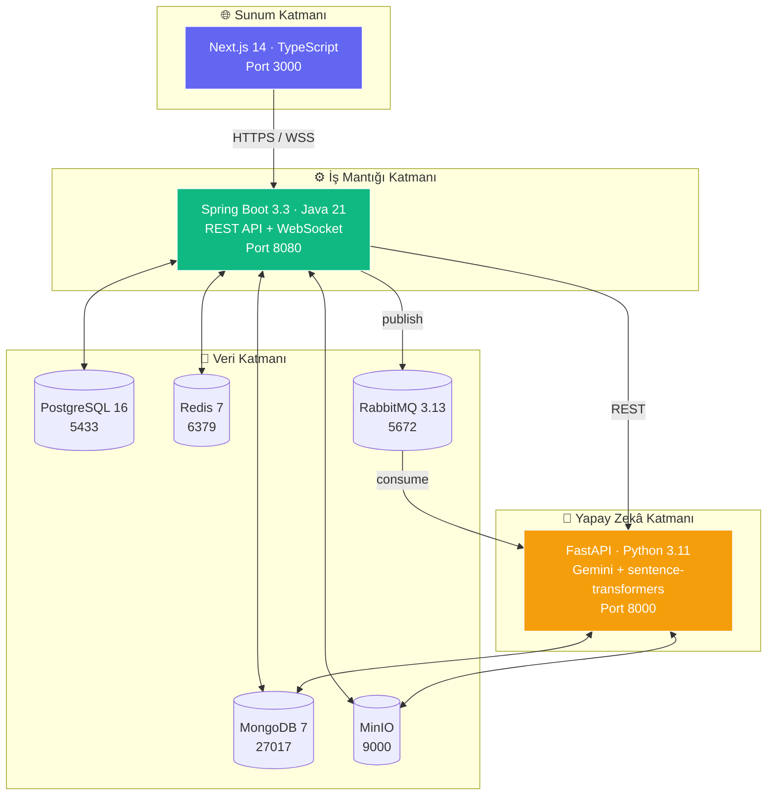
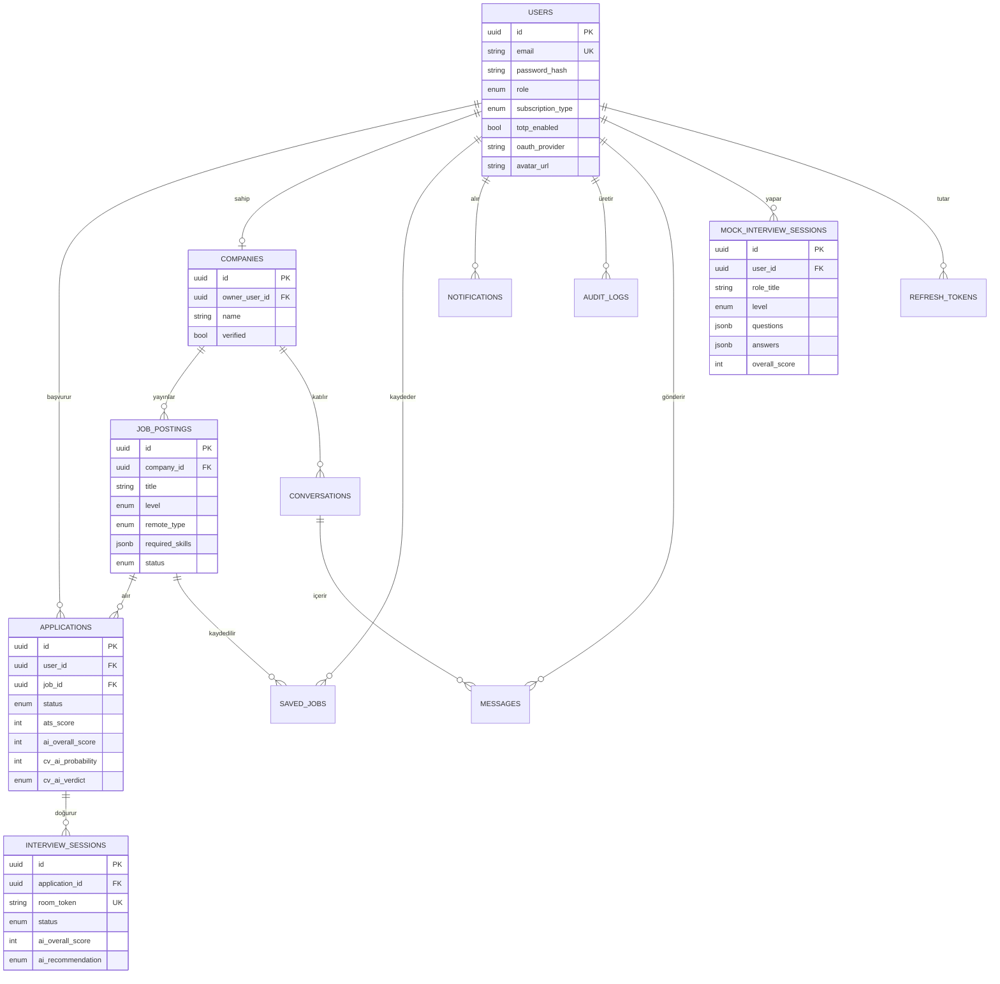
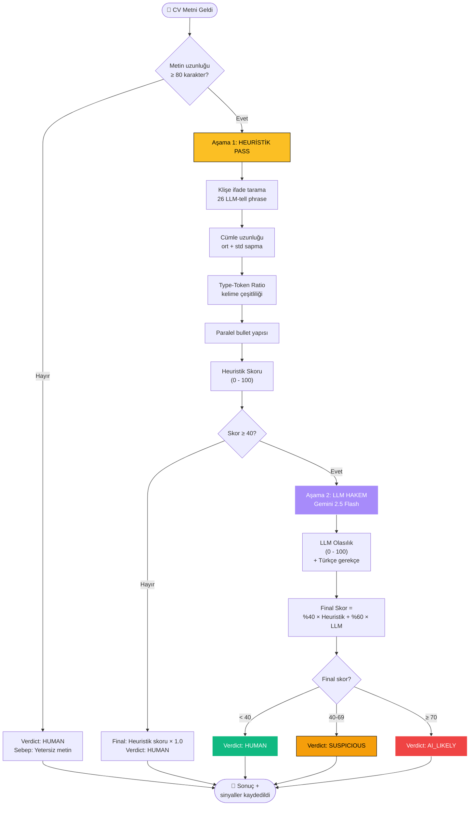
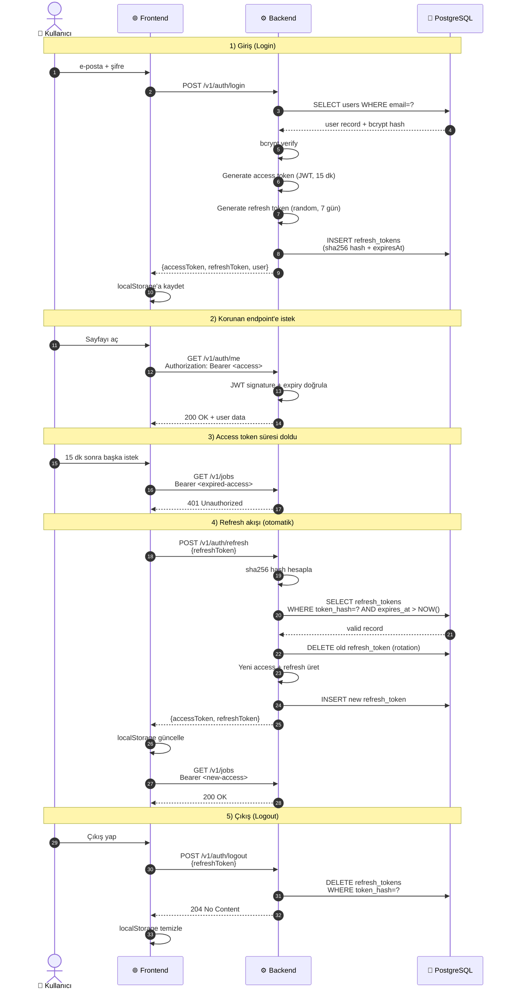

# Şekil 3.3 — Üç Katmanlı Mikro Hizmet Diyagramı

---

# Şekil 3.4 — Veri Modeli (ER Diyagramı)

---

# Şekil 3.5 — AI-CV Tespit Algoritması (İki Aşamalı Boru Hattı)

---

# Şekil 3.6 — JWT + Refresh Token Akışı

